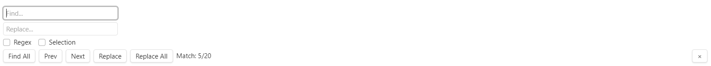

This is a sample Find and Replace plugin for Obsidian .

Support:

- Find and replace in current file .
- Support regex

TODO:

- The display style for location tracking has not been done yet(use setSelection now, no highLighting).
- No case-sensitive .
- Find and Replace in current selection
- Waiting to update to codemirror 6.x .
